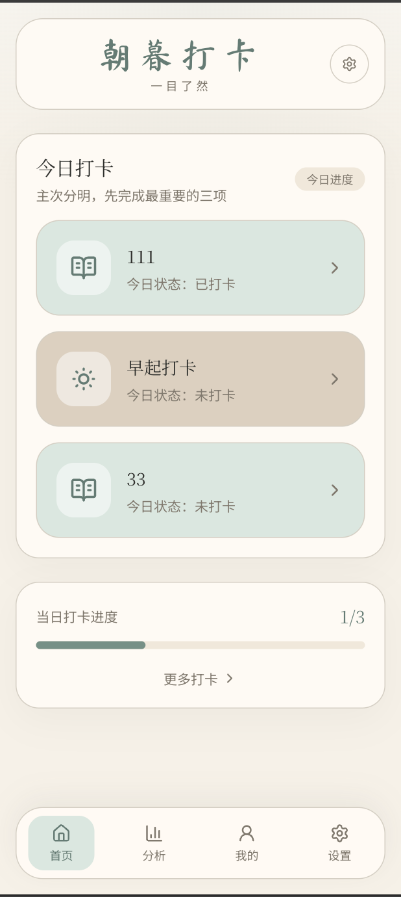
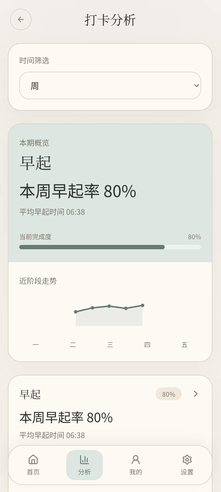
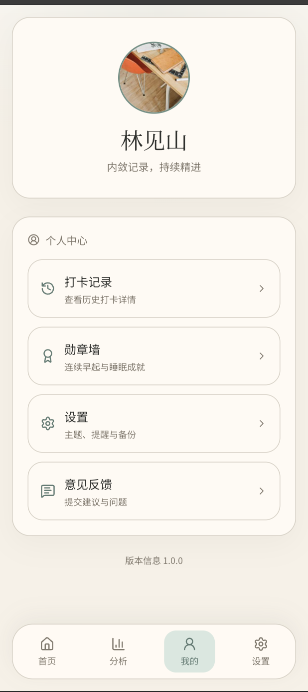
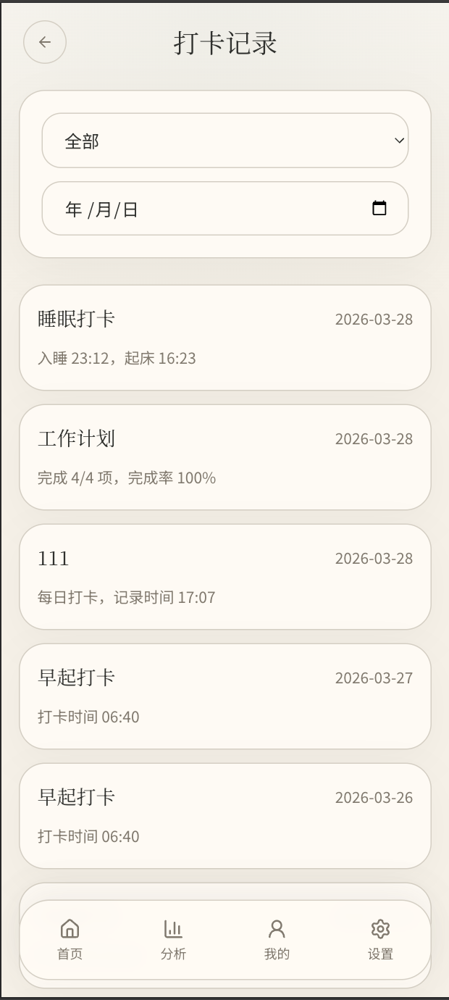
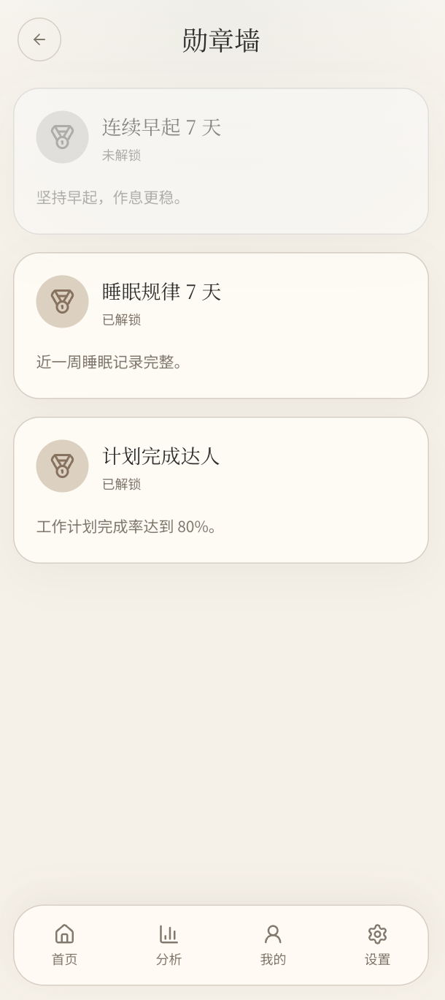
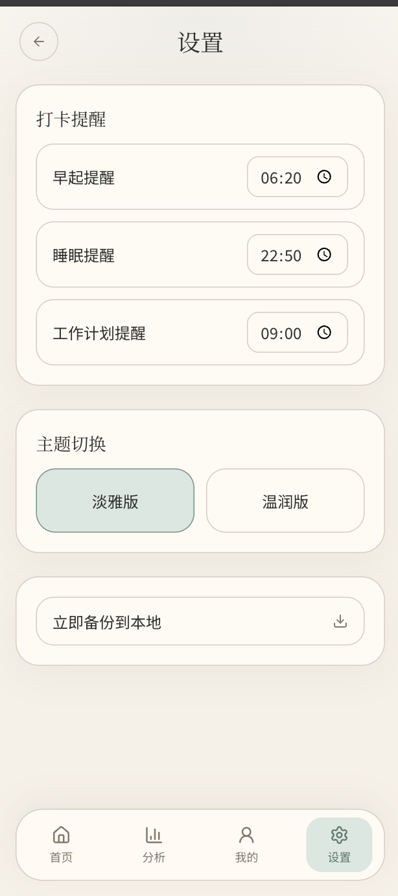

# 静心记 · Quiet Mind Journal

> 一个以中式简约视觉为核心的打卡与习惯记录应用原型，围绕"早起、睡眠、工作计划"三类核心打卡，同时支持自定义打卡扩展，并提供分析、历史记录、勋章、设置等配套页面。

---

## 项目定位

静心记不是传统信息堆叠式的任务工具，而是更强调：

| 特点 | 说明 |
|------|------|
| 仪式感 | 温润、留白、低干扰的界面承载日常打卡 |
| 便捷性 | 首页直接展示最重要的打卡事项 |
| 可总结 | 分析页用图表与周历热力展示近期状态变化 |
| 可扩展 | 支持新增自定义打卡，如运动、阅读、喝水等 |

---

## 核心功能

### 首页
- 展示"全部打卡"排序后的前 3 项
- 显示今日打卡进度
- 支持进入设置页和全部打卡页

### 打卡详情
- **早起打卡**：记录当日打卡时间，展示本周打卡日历
- **睡眠打卡**：记录入睡 / 起床时间，展示近 7 天睡眠预览
- **工作计划打卡**：管理今日计划、勾选完成、完成打卡
- **自定义打卡**：支持备注、连续打卡统计和历史预览

### 全部打卡
- 长按上下拖动排序，结果与首页联动
- 点击右侧箭头展开「修改 / 删除」操作
- 底部「添加」按钮弹出新增打卡弹框

### 分析中心
- **分析首页**：展示主要打卡项的概览卡、迷你走势和完成度
- **独立分析页**：包含核心指标、环形达成、趋势曲线、周历热力、规律总结
- **自定义打卡分析页**：沿用统一的数据展示风格

### 我的页面
- 打卡记录 · 勋章墙 · 设置入口 · 意见反馈

### 设置
- 早起 / 睡眠 / 工作计划三类提醒时间
- 主题切换（淡青 / 雅棕）
- 本地数据备份

---

## 视觉风格

- 米白底色，低干扰留白设计
- 淡青 / 雅棕双主题可切换
- 中式字体搭配简约线条与圆角卡片
- 避免强刺激色彩和复杂装饰

---

## 页面截图

<table>
  <tr>
    <td align="center"><b>首页</b></td>
    <td align="center"><b>分析中心</b></td>
  </tr>
  <tr>
    <td></td>
    <td></td>
  </tr>
  <tr>
    <td align="center"><b>我的页面</b></td>
    <td align="center"><b>打卡记录</b></td>
  </tr>
  <tr>
    <td></td>
    <td></td>
  </tr>
  <tr>
    <td align="center"><b>勋章墙</b></td>
    <td align="center"><b>设置页</b></td>
  </tr>
  <tr>
    <td></td>
    <td></td>
  </tr>
</table>

---

## 技术栈

| 技术 | 说明 |
|------|------|
| React 19 | 核心 UI 框架 |
| TypeScript | 类型安全 |
| React Router | 路由管理 |
| Vite | 构建工具 |
| Tailwind CSS v4 | 样式系统 |
| Lucide React | 图标库 |
| Motion | 动画效果 |

---

## 项目结构

```text
src/
  App.tsx                    应用主状态与路由
  main.tsx                   入口文件
  index.css                  全局样式与主题变量
  types.ts                   数据类型定义
  components/
    Home.tsx                 首页
    MorningCheckIn.tsx       早起打卡
    SleepCheckIn.tsx         睡眠打卡
    WorkPlan.tsx             工作计划打卡
    Analysis.tsx             分析首页
    Profile.tsx              我的页面
    Layout.tsx               全局底部导航布局
```

---

## 本地开发

```bash
# 安装依赖
npm install

# 启动开发环境（默认 http://localhost:3000）
npm run dev

# 类型检查
npm run lint

# 构建生产版本
npm run build
```

---

## 当前实现说明

当前版本是**高保真前端原型**，已具备主要交互和页面联动能力：

- 打卡状态本地持久化
- 全部打卡排序与首页联动
- 自定义打卡的新增、修改、删除
- 分析页面图表化展示
- 本地 JSON 备份

以下功能仍属于前端原型层：

- 系统通知提醒
- 云端同步
- 真正的 PDF 导出
- 多用户登录
- 后端数据存储

## 适合继续扩展的方向

- 接入本地通知或推送提醒
- 增加真实数据统计维度，例如阅读时长、饮水次数、运动分钟数
- 为分析页增加交互 hover、tooltip 和更细致的时间筛选
- 接入后端与账号系统，支持跨设备同步

## 项目名称

- 中文：静心记
- 英文：Quiet Mind Journal
